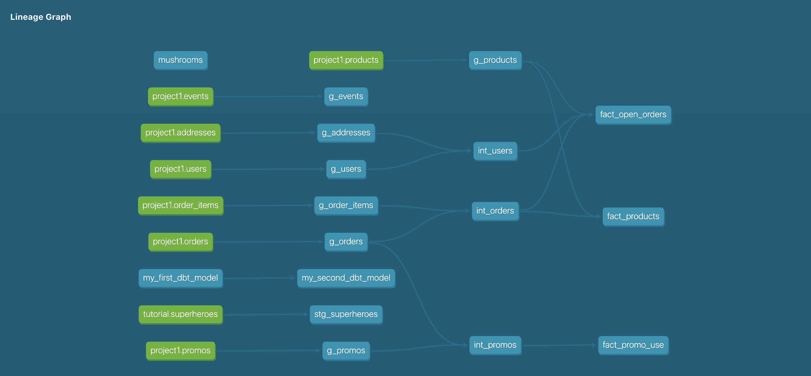

**PART 1**

**Questions:**
1. 80%. 
    *Query: SELECT ROUND(((count(distinct case when orders >= 2 then user_id else null end)) :: DECIMAL / count(distinct case when orders > 0 then user_id else null     end)),2) FROM (SELECT user_id, count(distinct order_id) as orders FROM orders GROUP BY 1 ORDER BY 1) s*
2. From the data we have, I think factors like speedy delivery, other website events and would be interesting to explore. It would also be interesting to see if some folks only buy when there are promos (indicating they won’t purchase again until there’s another promo). In terms of data we don’t have: user ratings/reviews of products would be helpful.

**Models**
Intermediate models:
    1. PRODUCTS: Joining together orders and order items so we can have all basic info about orders in the same place. int_orders
    2. CORE: Joining together users and addresses so we can have all basic info about users in one place. int_users
    3. MARKETING: Joining together orders and promos as int_promos and removing non-promo-related columns so we can have all basic info about promos in the same     place. int_promos

Fact/dim models: 
        1. PRODUCTS: Fact model that provides an overview of all products ordered; could use to see popular products, order trends, etc.
        2. MARKETING: Fact model that perform some aggregation on the int_promos table to clearly see how promotions are being used.
        3. CORE: Fact model that uses several of the int models to provide an overview of open orders; could be used for customer service inquiries. 

**PART 2**
